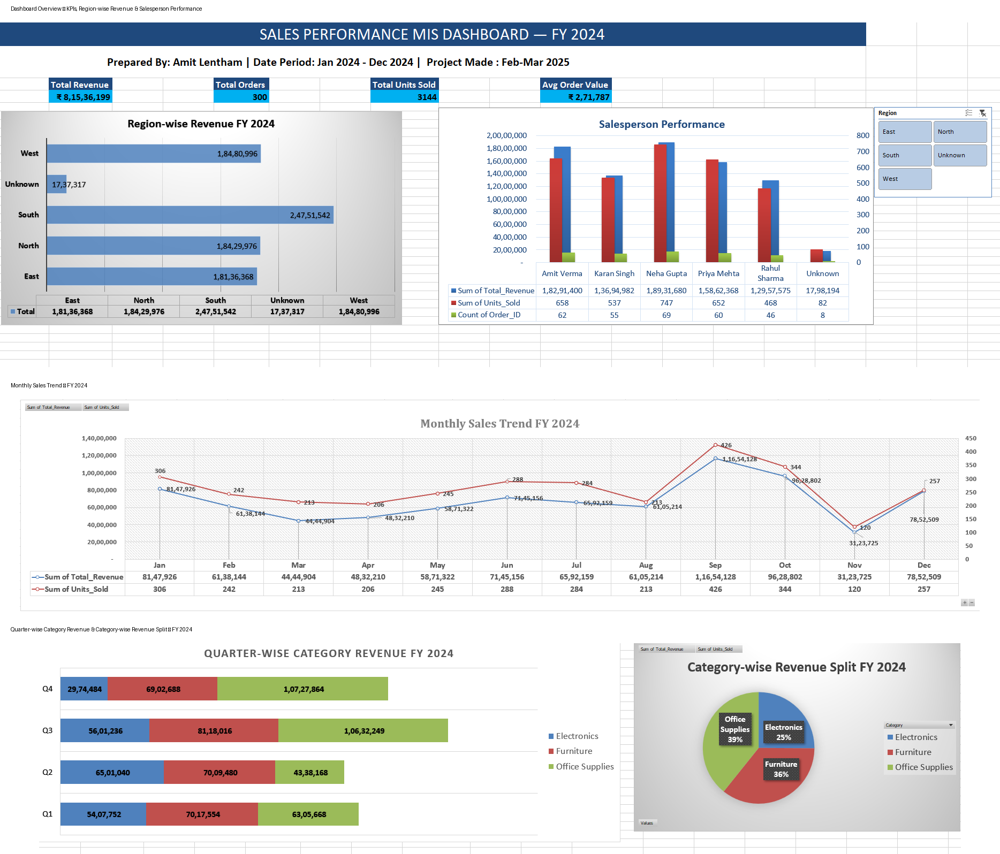
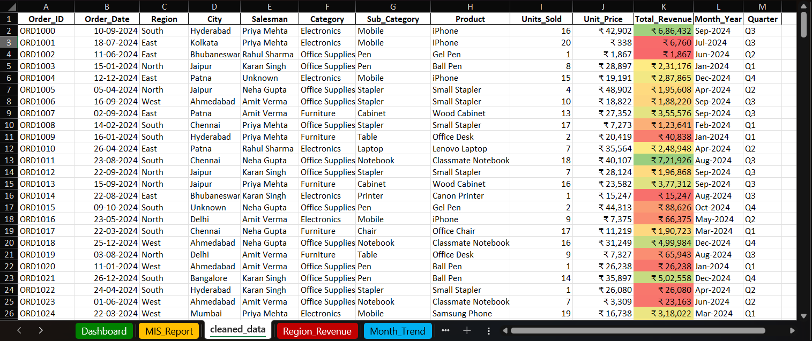
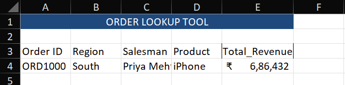

# Sales Performance MIS Dashboard

## Project Overview

This project is an Excel-based Sales Performance MIS Dashboard developed to analyze sales data and prepare structured management reports.

The project covers the complete data-handling process from raw data cleaning and validation to MIS reporting, analysis, dashboard creation, and order-level information lookup.

## Project Highlights

- **More than 300 orders**
- **₹8.15 Crore in revenue**
- **5 regions**
- **6 salespeople**
- **3 product categories**
- FY 2024 sales analysis

## Tools Used

- Microsoft Excel
- Pivot Tables
- Pivot Charts
- SUMIF
- COUNTIF
- VLOOKUP + MATCH
- Data Validation
- Conditional Formatting
- Slicers

## Data Cleaning & Preparation

The raw sales data was cleaned and standardized before reporting.

The cleaning process included:

- Checking blank records
- Identifying duplicate records
- Standardizing inconsistent spellings
- Handling mixed date formats
- Converting numbers stored as text
- Maintaining data consistency and accuracy

## MIS Reporting & Analysis

The project includes multiple reports for analyzing sales performance:

- Region-wise Revenue
- Monthly Sales Trend
- Category-wise Revenue
- Salesperson Performance
- Quarterly Sales Summary

Pivot Tables and charts were used to create structured reports for easier analysis.

## Order Lookup Tool

A dynamic Order Lookup Tool was created using **VLOOKUP + MATCH** with a Data Validation dropdown.

It allows quick retrieval of order-level information such as:

- Order ID
- Region
- Salesperson
- Product
- Revenue

## Dashboard

An interactive Excel dashboard was created using:

- KPI summaries
- Charts
- Slicers
- Conditional Formatting

The dashboard allows users to filter and review sales performance across different regions and categories.

## Business Questions Answered

The dashboard and reports help answer questions such as:

- Which region generated the highest revenue?
- Which month was the peak sales period?
- Who was the top performing salesperson?
- How did sales trend across quarters?
- Which product category contributed most?

## Project Structure

The Excel workbook contains:

- Raw Data
- Cleaned Data
- MIS Reports
- Dashboard
- Region Revenue
- Monthly Trend
- Category Revenue
- Salesperson Performance
- Quarterly Summary
- Order Lookup Tool

## Project Screenshots

### Dashboard Overview

### Data Cleaning

### Order Lookup Tool

